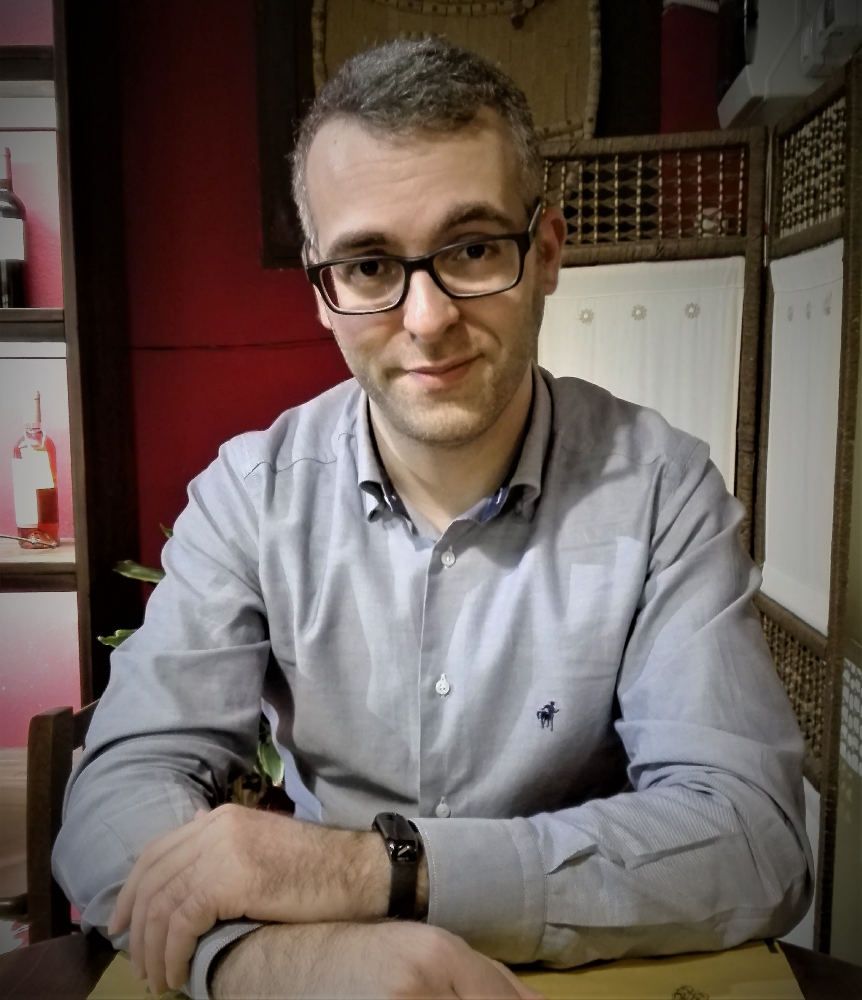

# Nicola Orritos - Curriculum Vitae

  

## At a glance

I'm a software engineer specialized in microservices and the Node.js stack.  

I was born in Ozieri October, 22 in 1983.  
I currently live in Serdiana, near Cagliari, Sardinia.  

[@Website](http://nicolaorritos.github.io) -
[@GitHub](https://github.com/NicolaOrritos) - [@LinkedIn](https://www.linkedin.com/in/nicolaorritos)

## Experience

#### EY Advisory | November 2017 - Now
After the Applix acquisition I'm now working as a fullstack developer on customer projects and internal products, usually developing and integrating REST solutions with both web frontends and mobile apps.
I'm also involved in R&D in the blockchain field, studying the Ethereum platform and Solidity smart-contracts.  
Still studying Data Science in my free-time.

#### Applix Srl | January 2017 - November 2017
Web architect for an internal product; working with a (M)EAN stack, Grunt, Protractor, Karma, Jenkins and a couple more.  
Teaching myself Python, Data Science and Machine Learning during my free-time.

#### Applix Srl | January 2014 - January 2017
Web architect and lead developer of the web magazines viewer, part of the company's flagship product _Viewer+_.  
Also a developer of the desktop versions, one based on _Qt 5_ (both for OSX and for Windows) and the other based on Microsoft _"Modern" UI_ and written in C#.  
Creator and mantainer of many personal projects: most of them are based on Node.js, a few are HTML5 web-apps.  
Some of these projects (_"bagarino"_, _"progenic/probiotic"_, _"conf.d"_ and others) have been adopted and _battle-tested_ on production servers.

#### Applix Srl | April 2012 - January 2014
Back at Xorovo (which became an _Applix Group_ company in the meanwhile) where I took part in a project for __Vodafone Italia__ as a backend Java developer.  
The focus of the project it's been the creation of a streaming app for Italy's _Serie A_ tournament which included a social platform where tweets and facebook posts could be exchanged among people watching the same match.

#### Akhela Srl | February 2010 - April 2012 | Consultant
Two years with _Akhela_ were I worked as a requirements analyst and developer with the team that created the daemon responsible for handling consumer multimedia devices connected to the _EntryNAV_ Infotainment system, developed by __Magneti Marelli__ for __BMW__.  
For a brief time I was also in charge of handling bugs and Change Requests for the same team, collaborating with teams from Akhela, BMW, Magneti Marelli, Windriver and other companies involved in the project.

#### Xorovo Srl | January 2008 - February 2010
Recruited by Xorovo (at the time a startup spin-off of the Cagliari University) as C/Java analyst and developer.  
Developed server-side solutions with Java and desktop applications based on the Eclipse platform.

#### March 2006 - June 2007
First job with former _Sarda EDP_: I took part in the creation of a trouble-ticket management system for Tiscali Italia call-centers.

## Skills
I developed a strong OOP background in many languages (mainly C++, C# and Java) but I'm currently absorbed by asyncronous programming with Javascript and REST architectures.  
Server-side Javascript is the platform I'm versed the most: I've been an enthusiast adopter of ES6 and Promises, working with Express, Restify, Grunt, many different and popular node modules and the Node.js ecosystem in general, contributing to the adoption of microservices-based architectures in production environments.

I know pretty well some SQL solutions and NoSQL ones: I worked in the past with MySQL and Postgres and I developed solutions based on Redis and MongoDB/RethinkDB.  
I have some elements of Electron, Android and iOS.
I know a fairly decent amount of Bash and C.  
I worked with Apache, Nginx and I know how to configure Linux-based systems (Arch Linux, Amazon AMI Linux, Debian-based).

Lately I'm focusing my efforts in studying Data Science with Python, mainly because I'm eager to dive in the Machine Learning field.  
I also studied two blockchain platforms, Bitcoin and Ethereum, focusing my efforts on the Solidity smart-contracts language and on _Dapps_ (Ethereum _Distributed apps_) development using _web3.js_.

## Education

#### October 2002 - February 2006
Bachelor Computer Science degree at University of Cagliari.  
Graduated with 107/110.

## Extra-curricula
I love reading books about the most disparate arguments: neuro-science, mankind history, astrophisics and Science in general.  
I'm a Tai Chi practitioner, I like MTB and Nature and I'm a strong believer in Environment protection.

## More
For additional details and contact info see my [LinkedIn profile](http://it.linkedin.com/in/nicolaorritos/).
